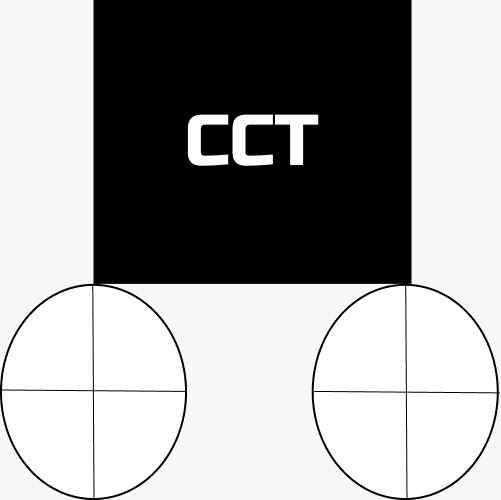
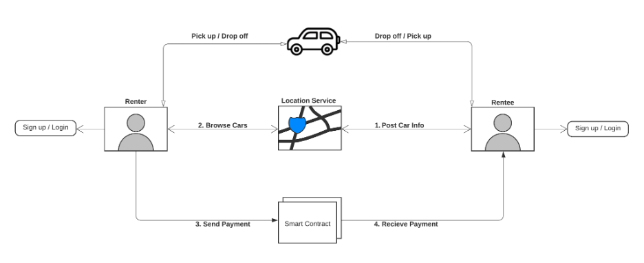
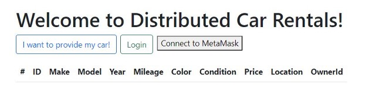
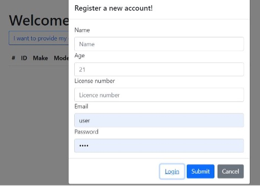
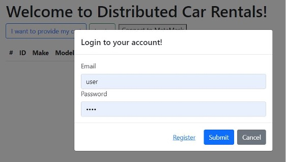
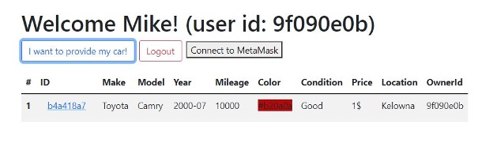
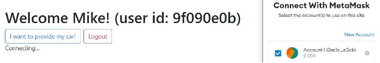
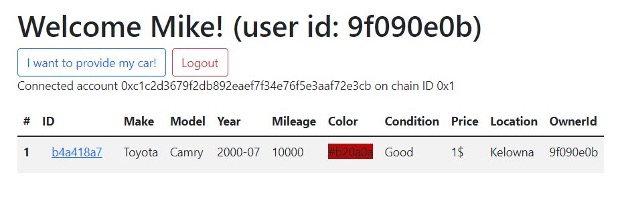
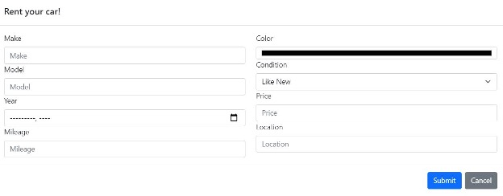
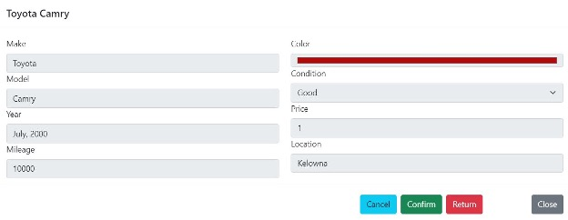

# CarConTracks 

Code & documentation for the EECE 571G term project: CarConTracks DApp 

Authored by Negar Yassaie, Sara Gargoum, Mateusz Faltyn

## Brief Introduction to Our Project
- “On-demand” car-sharing services such as Modo and evo have spread to many urban areas across the world. However, all of these services suffer from issues of centralization such as security issues, privacy issues, and central points of failure; there is a need for decentralized solutions. 
- Our aim in this project is to fill this gap in the market by creating a peer-to-peer car rental decentralized application. 
- CarConTracks is an Ethereum-based DApp that allows individuals with the appropriate legal qualifications (i.e., age and driver’s license) to rent a car for a specific duration of time. Instead of signing in to an app of a centralized carsharing service provider such as Modo or evo, users of CarConTracks will be able to rent a car in a peer-to-peer manner anywhere across the globe where cars are located.

## Screenshots of Our Project

### Architecture
> The figure below displays the system architecture of the CarConTracks DApp.
 

### Inital Screen
> The figure below displays the initial banner that is displayed on a user’s webpage when they access CarConTracks DApp.
 

### Registration
> The figure below displays the registration webpage.
 

### Sign In
> The figure below displays the sign in webpage.
 

### Logged In
> The figure below displays the webpage when the user is logged in.
 

### Connecting to MetaMask
> The figure below displays the webpage when the user is connecting to MetaMask.
 

### Connected to MetaMask
> The figure below displays the webpage when the user is connected to MetaMask.
 

### Loaning a Car
> The figure below displays the webpage when the user is in the process of loaning a car.
 

### Renting a Car
> The figure below displays the webpage when the user is in the process of renting a car.
 

## Running this Project

### Software Versions
The following software versions are used:
- nvm version 0.39.1
- node version 16.13.0
- npm version 8.1.0
- hardhat version 2.9.1
- solidity version 0.8.0

### Running Instructions

1. Clone the repo and cd into it `git clone https://github.com/mattfaltyn/CarConTracksV1.git && cd /CarConTracksV1/Dapp`
2. Install deps with yarn `yarn` or npm `npm install`
3. Start hardhat `npx hardhat node --watch`
4. Open up a new terminal
5. Enter the frontend directory: `cd Frontend`
6. Install dependencies: `npm install`
7. Import seed phrase in Metamask. The default mnemonic currently used by hardhat is `test test test test test test test test test test test junk`
8. Ensure Metamask RPC is set to `http://localhost:8545` and chainID `31337`.
9. Start the React app: `npm start`

The frontend should open at http://localhost:3000/
